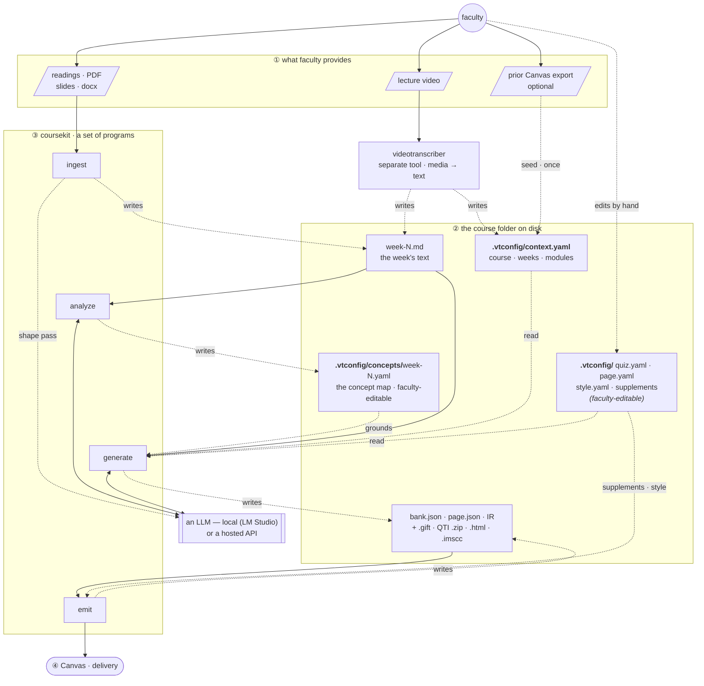
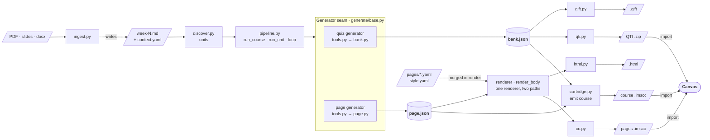
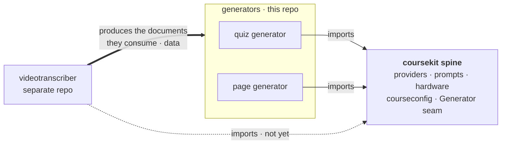

  # Toolkit architecture

Source of truth for the structural diagrams. Kept in `agent/` alongside the other tracked references.
Presented version: <https://claude.ai/code/artifact/e0d099ed-016c-4911-a75d-7805d5dbffe0>

Verified 31 July 2026 against `main`.
Since the 27 July pass (CLI subcommands + `emit course`) this adds the **analyze** phase (a per-week concept map), the **output-worth evaluator** (facticity · pedagogy · concept-delivery cold reads), and the targeted **fix** loop that regenerates flagged items in place.
The videotranscriber (separate repo at `~/video_transcription`) is unchanged since the 19 July pass.
The test count lives only in `README.md`, where a meta-test (`tests/test_docs_facts.py`) keeps it honest — it is deliberately not repeated here, because a number stated in two places rots in one of them.

## Three views

Three stories, three diagrams. First the **system in four layers** — who provides what, where the files live, what coursekit actually *is*, and where the output goes (read this one first).
Then **what happens inside coursekit** (the pipeline waist).
Module-level dependencies are the third view, [below](#dependency-direction).

### The system, in four layers

The pieces fall into four layers.
The two things this makes explicit — because the old diagram hid them — are that **`.vtconfig/` is just local files in the course's own folder, created by the tools but freely hand-editable by faculty**, and that **coursekit is a set of programs that *drive* an LLM (local or hosted), not a model itself**.

**① What faculty provides.** The raw material for a week: a lecture video, or readings / PDFs / slides (`.docx`, `.odt`), or — for a course already living in Canvas — a prior course export.
Nothing here is coursekit-specific; it is what the instructor already has.

**② The course folder on disk.** A plain local directory — the course's own folder, marked by a `.vtconfig/` subfolder — holding two kinds of file:

- **the `.vtconfig/` reference:** `context.yaml` (course · weeks · modules) and the per-tool config (`quiz.yaml`, `page.yaml`, `style.yaml`, the per-week supplements, prompt overrides). The tools create these, but they are **faculty-editable** — a professor changes a theme, tunes a prompt, adds a supplement link, or fixes a week title by hand in an ordinary text editor. It is a *local reference coursekit both writes and reads*, not a hidden store.
- **the generated files:** `week-N.md` (the week's text), the `bank.json` / `page.json` IR, and the emitted artifacts (`.gift`, QTI `.zip`, `.html`, `.imscc`).

Everything is plain, versionable files in the course folder — never a database. coursekit **writes** here (week text, IR, artifacts) and **reads** here (config); the transcriber writes here too (`context.yaml`, `week-N.md`).
That file boundary is why the two tools stay separate repos with disjoint runtimes — the transcriber keeps `mlx-whisper` and its Apple-Silicon stack; coursekit stays pydantic + stdlib — and neither imports the other.

**③ coursekit — a set of programs.** Four phases run locally: **ingest** (documents → `week-N.md`), **analyze** (week text + the transcriber's `knowledge.json` → the per-week concept map), **generate** (week text → `bank.json`/`page.json`), **emit** (IR → Canvas files).
Two more verbs sit alongside them as the *output-worth* layer: **evaluate** (cold-read the committed IR for correctness, form, and concept-delivery) and **fix** (regenerate each flagged item in place).
All of these except `emit` — and ingest's optional shaping pass — **call an LLM, either one you host locally (LM Studio by default) or a hosted API.** coursekit holds no model of its own; it drives whichever provider is configured, which is what lets the whole thing run offline when the LLM is local. (The transcriber is the *media→text* front door; ingest is the *document→text* one — two ways onto the same folder.)

**④ Delivery — Canvas.** The emitted artifacts import into Canvas (a QTI `.zip`, or an `.imscc` course package).
Canvas is a **sink**.
The one loop back is optional and one-time: a *prior* Canvas export can seed `context.yaml` with real module and week titles — a file read, not a live coupling, and `context.yaml` builds fine from a filesystem scan alone.

### Inside coursekit — the pipeline (the waist)

**The waist.** Each artifact family has one canonical IR — quizzes converge on `bank.json`, pages on `page.json` — and every emitter reads only its IR (gift/qti from `bank.json`; html/cc from `page.json`).
Adding a platform costs one emitter, not one converter per input, and re-emitting needs no model: `emit qti`, `emit html`, and `emit cc` rebuild from the committed JSON.
`emit course` (`emit/cartridge.py`) sits one level up — it assembles *both* IRs into one Common Cartridge of week modules, via a `CartridgeSource` per content type (pages, quizzes today; discussions/assignments next), so a new content type is one source, not a new assembler.
A Canvas **API** emitter is the gated third delivery path — it will read the same IRs, so it is one more emitter, not a new pipeline.

**The one seam above the waist** — `generate/base.py` — is what the driver speaks: `pipeline.loop` knows only `reset · tools · run_tool_calls · is_finalized · nudge · result`, nothing about quizzes or pages.
That is how the page generator reused the whole driver without touching `run_unit`, and why a third generator would too.

### The output-worth layer — analyze, evaluate, fix

Beyond generation, coursekit **understands, measures, and repairs** its own output — the layer the incumbents' generators don't have.

- **analyze** (`generate/page/concept_map.py` + `consolidate.py`) builds a per-week **concept map** — the teaching concepts, their nested knowledge components, and the one enduring understanding — from the transcriber's `knowledge.json` when present, or the week text when not (same schema, swappable producer). It lands in `.vtconfig/concepts/week-N.yaml` (faculty-editable) and is read by the page generator (as an un-skippable teaching checklist) and by the evaluator (a fixed list to score against, rather than one re-derived each read).
- **evaluate** is the *output-worth* gate — three cold reads over the committed IR, in a fresh conversation per item so it is not the generator grading itself: **facticity** (is each item correct?), **pedagogy** (does the page scan / signal / engage?), and **concept-delivery** (does it teach each concept?). Report-only.
- **fix** closes the loop (`generate/quiz/fix.py`, `generate/page/fix.py`): for each flagged quiz variant or page block it hands the model the material, the flawed item, and the reviewer's concern, and takes a correction committed through the SAME tool with the SAME id — overwriting in place via `bank.load` / `page.load` — then cold-reads the fix to confirm it now passes.

Evaluate and fix read the same IR the emitters do, so the whole flow is **generate → audit → repair → emit**, and only `emit` needs no model.

## Finding the course folder

Layer ② is located, not configured: coursekit **walks up from its input** to find the `.vtconfig/` marker (the way git finds `.git`) and reads `context.yaml` for week titles and module names.
It **degrades gracefully** — no `.vtconfig/` at all means coursekit infers the week from the filename, so a loose `week-3.md` still works.
(`.vtconfig/` is the transcriber-era name; a rename to something tool-neutral is noted in the backlog.)

## Dependency direction

**Two kinds of arrow, because there are two kinds of dependency** — the earlier version showed only the code one, which made the transcriber look barely connected when in fact everything downstream starts with its output.

- **Data (thick).** The transcriber produces the `week-N.md` documents the generators turn into artifacts — the generators are *downstream* of it. The coupling is through the course directory, not an import (any markdown works; the transcriber is just where the documents come from), which is exactly why they can be separate repos.
- **Code (thin).** Both generators import the coursekit spine through the one `Generator` seam (`generate/base.py`): the driver (`run_unit`/`run_course`/`loop`) knows nothing about quizzes or pages, so the page generator reused it untouched. Quiz = `bank.json` → GIFT/QTI; page = `page.json` → HTML, supplements merged at render.

No cycle on either axis.
The transcriber does **not** import the spine yet — same capabilities, its own copies — and that dashed edge is the migration debt, which is measurable:

| Concern | videotranscriber | coursekit | Status |
| --- | --- | --- | --- |
| Provider | `vt_provider.py` (694 ln) — LM Studio, Ollama, Anthropic, OpenAI; `classify_error`, `discover_loaded`, `unload_all`, vision capability | `providers/` (194 ln, whole package) — OpenAI-compatible only, **but tool-calling** | **Diverged, complementary** |
| Prompts | `vt_prompts.py` (415 ln) — same resolution, plus interactive authoring/editing | `prompts.py` (97 ln) — same mechanism, raises instead of `sys.exit` | Mechanism matches |
| RAM check | `vt_common.py` — two safety factors (0.7 available / 0.35 total), `recommend_model` | `hardware.py` — 0.7 only, plus `loaded_model_keys()` via `lms ps` | **Diverged copies** |
| Project root + config | `find_project_root()`, `find_context_file`/`find_config_file`, week-key parsing — spread across `vt_common.py` | `courseconfig.py` (171 ln) — all of it in one spine module | **Unified in quizbot; transcriber pending** |

The RAM row is the cautionary one: each copy has grown a capability the other lacks.
`recommend_model` only exists in the transcriber; `loaded_model_keys` (already-loaded models fit by definition) only exists in quizbot.
That is the copy-paste rot the spine was created to stop, and it is already real.

**Merging the providers means the union, not a pick.** The transcriber's has breadth (four vendors, error classification, model lifecycle); coursekit's has the tool-calling contract the transcriber never needed.
Neither is a superset.
Anthropic support in particular is *already written* in `vt_provider.py` for prose — extending it to `tool_use` is a smaller job than starting cold.

## The config gap — closed

Three defects, one root cause: `discover.py` parsed config as a side effect of finding weeks, so nothing was looked for that discovery didn't already need.
`courseconfig.py` (a spine module below discovery) fixed all three.

**The design turn: per-tool config files are separate.** `context.yaml` is shared course structure; each tool's *technical* settings are private to it, because the tools do different jobs.

| File | Owner | Read by |
| --- | --- | --- |
| `context.yaml` | authored by the transcriber (`vt_context.py`) | **both** — shared course facts |
| `config.yaml` | the transcriber | the transcriber only |
| `quiz.yaml` | quizbot | quizbot only |

`courseconfig` is the shared *mechanism* — `find_root`, read a yaml file by name, `week_key` normalisation, `load()` that never raises.
Each tool owns its *file*.

What that closed:

- ✅ **Prompt override reachable from the CLI.** `run_unit` passes `project_root=unit.course_root`, so a course's `.vtconfig/prompts/quiz/*.md` override applies. (Was shipped but unwired; mutation-tested.)
- ✅ **Prompts nameable per course.** `quiz.yaml`'s `system_prompt:` / `task_prompt:` keys select a named prompt — quizbot's equivalent of the transcriber's `pedagogy_prompt:` etc. The fallback is caller-supplied (`default="system"`), because quizbot's prompts are `system.md`/`task.md`, not `default.md` — a wrong default would silently request a missing file.
- ✅ **Model per course.** `quiz.yaml`'s `model:` fills in when `MODEL_NAME` is unset.
- ✅ **The duplicated logic is gone.** `discover._find_course_root`, `_load_vtconfig`, `_week_number`, and `pipeline._week_key` all deleted; `discover.py` is 29 lines shorter.

**Slug convention — deliberately *not* changed.** The transcriber writes `output/week 3/` (space), quizbot writes `quizzes/week-3/` (hyphen).
Centralising `week_key` is the whole fix: matching is uniform now, and the two trees never collide.
Changing any *on-disk* path would orphan the eight weeks of ARST260 quizzes already emitted, so the paths stay as they are.

## Order of operations

Unchanged trigger for the rename (generator #2, not a date), but sharpened:

1. ✅ **Wire the prompt override** — done.
2. ✅ **`courseconfig`, at spine level** — done; the spine (providers · prompts · hardware · courseconfig) is complete.
3. ✅ **The rename** (quizbot → coursekit) — done, one isolated commit, into the package layout above.
4. ✅ **Generator #2 (pages)** — done: the `Generator` seam + `page.json` IR + Jinja renderer + standalone-HTML emitter + a per-week supplements file for instructor links + the **Common Cartridge page emitter** (`emit/cc.py`, `--to-cc`) — one `.imscc` of `type="webcontent"` wiki pages that imports as **Pages** (the `course_settings/canvas_export.txt` marker flips Canvas into its own importer; without it webcontent lands in Files) and places them in one module via `course_settings/module_meta.xml` + the manifest's `<organizations>` tree. Never ships `course_settings.xml`, so it can't mutate the target course. Ground-truthed against the ARGS260 export; the Pages/modules import is **confirmed in situ**, styled body surviving Canvas's sanitizer.
5. ✅ **The design system** — themes as full identities (bauhaus · terminal · plotter · studio) resolved at render time, a Canvas CSS allowlist + WCAG guardrails, and section roles where design meets pedagogy (recap component, glossary "Key Terms" frame). See `docs/design.md`.
6. ✅ **Document ingest** (`coursekit/ingest/`) — PDF/pptx/docx/odt/txt/md → `week-N.md`, so non-video courses work; `--raw` stays fully offline. coursekit's own front door onto the bus (View 1).
7. ✅ **The whole-course cartridge + CLI shape** — `emit course` assembles pages *and* quizzes into one `.imscc` of week modules via a `CartridgeSource` per content type (extensible to discussions/ assignments); the CLI became phase subcommands (`ingest` / `generate` / `emit`) under a `coursekit` command. Import **confirmed in situ**.
8. ✅ **The output-worth evaluator** — three cold-read checks (facticity · pedagogy · concept-delivery) over the committed IR, calibrated on synthetic sets and wired into `evaluate` / `evaluate --all`.
9. ✅ **The analyze phase + concept map** — per-week `.vtconfig/concepts/week-N.yaml`, from the transcriber's `knowledge.json` or the week text, grounding page generation and evaluation.
10. ✅ **The targeted fix loop** — `fix` regenerates each flagged quiz variant / page block in place and verifies (`bank.load` / `page.load` adopt a finished artifact for in-place edit).
11. **Migrate the transcriber onto the spine** — providers first, taking the union of capabilities.
12. **Canvas API emitter stays gated** on the local Canvas. File emitters remain first-class.

## Not yet closed

- **The transcriber still carries its own copies** of provider, prompts, RAM check, and project-root logic (the diverged rows above). `courseconfig` is the surface it *can* adopt, but the adoption is its own increment in that repo — this side only built the target.
- **Interactive prompt authoring** (`_author_new_prompt` / `_edit_existing_prompt`) and **persisting a choice back to config** live only in `vt_prompts.py`. `courseconfig` is read-only: quizbot writing into a course's config is a real decision, deferred not forgotten.
