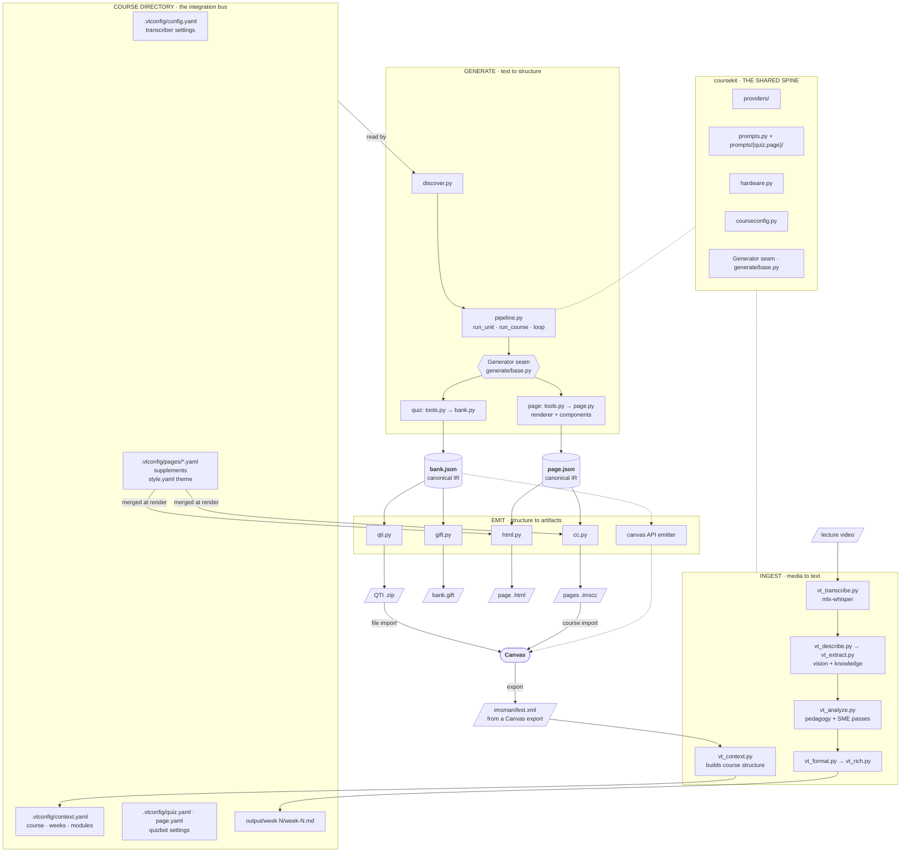
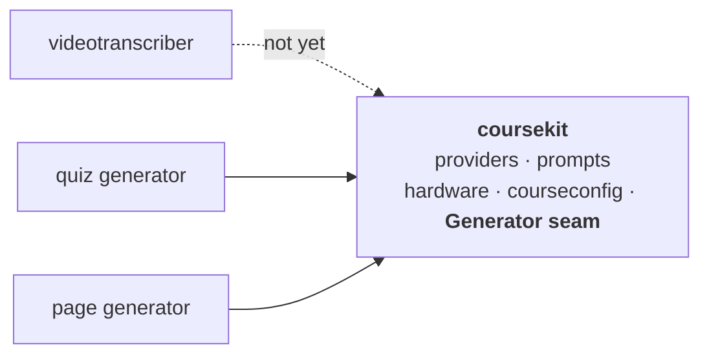

# Toolkit architecture

Source of truth for the structural diagrams. Kept in `agent/` alongside the other tracked references.
Presented version: <https://claude.ai/code/artifact/e0d099ed-016c-4911-a75d-7805d5dbffe0>

Verified 23 July 2026 against quizbot branch `coursekit-spine`. The videotranscriber (separate repo
at `~/video_transcription`) is unchanged since the 19 July pass. The test count lives only in
`README.md`, where a meta-test (`tests/test_docs_facts.py`) keeps it honest — it is deliberately not
repeated here, because a number stated in two places rots in one of them.

## Data flow

**Canvas is a source as well as a sink.** `vt_context.py` builds `context.yaml` from a media-dir
scan *plus a Canvas `imsmanifest.xml`* — which is why ARST260's context.yaml records
`sources: [filesystem, canvas_manifest]`. Module and week titles come out of a course export and
end up shaping quiz prompts. The loop closes.

**The waist.** Each artifact family has one canonical IR — quizzes converge on `bank.json`, pages on
`page.json` — and every emitter reads only its IR (gift/qti from `bank.json`; html/cc from
`page.json`). Adding a platform costs one emitter, not one converter per input, and re-emitting needs
no model: `--to-qti`, `--to-html`, and `--to-cc` all rebuild from the committed JSON. The one seam
above the waist — `generate/base.py` — lets a new generator reuse the whole driver, which is how the
page generator landed without touching `run_unit`.

## The course directory is the integration bus

The transcriber writes `.vtconfig/context.yaml`; quizbot walks up from its input to find it (the way
git finds `.git`) and reads week titles and module names. **Neither tool imports the other — the
contract is a file on disk.**

That is what lets them stay separate repos without drifting: the transcriber keeps `mlx-whisper` and
its Apple-Silicon dependency; quizbot's runtime stays pydantic + stdlib. It also degrades gracefully
— no `.vtconfig` means quizbot infers the week from the filename.

## Dependency direction

Both generators now depend on the spine through the same `Generator` seam
(`coursekit/generate/base.py`): the driver (`run_unit`/`run_course`/`loop`) knows nothing about
quizzes or pages, so the page generator reused it without touching it. Quiz = `bank.json` → GIFT/QTI;
page = `page.json` → HTML (Jinja components), with instructor supplements merged at render time.

One direction only, no cycle. **Quizbot depends on the spine today; the transcriber does not yet** —
it still has its own copies. That's the migration debt, and it is measurable:

| Concern | videotranscriber | coursekit | Status |
| --- | --- | --- | --- |
| Provider | `vt_provider.py` (694 ln) — LM Studio, Ollama, Anthropic, OpenAI; `classify_error`, `discover_loaded`, `unload_all`, vision capability | `providers/` (194 ln, whole package) — OpenAI-compatible only, **but tool-calling** | **Diverged, complementary** |
| Prompts | `vt_prompts.py` (415 ln) — same resolution, plus interactive authoring/editing | `prompts.py` (97 ln) — same mechanism, raises instead of `sys.exit` | Mechanism matches |
| RAM check | `vt_common.py` — two safety factors (0.7 available / 0.35 total), `recommend_model` | `hardware.py` — 0.7 only, plus `loaded_model_keys()` via `lms ps` | **Diverged copies** |
| Project root + config | `find_project_root()`, `find_context_file`/`find_config_file`, week-key parsing — spread across `vt_common.py` | `courseconfig.py` (171 ln) — all of it in one spine module | **Unified in quizbot; transcriber pending** |

The RAM row is the cautionary one: each copy has grown a capability the other lacks. `recommend_model`
only exists in the transcriber; `loaded_model_keys` (already-loaded models fit by definition) only
exists in quizbot. That is the copy-paste rot the spine was created to stop, and it is already real.

**Merging the providers means the union, not a pick.** The transcriber's has breadth (four vendors,
error classification, model lifecycle); coursekit's has the tool-calling contract the transcriber
never needed. Neither is a superset. Anthropic support in particular is *already written* in
`vt_provider.py` for prose — extending it to `tool_use` is a smaller job than starting cold.

## The config gap — closed

Three defects, one root cause: `discover.py` parsed config as a side effect of finding weeks, so
nothing was looked for that discovery didn't already need. `courseconfig.py` (a spine module below
discovery) fixed all three.

**The design turn: per-tool config files are separate.** `context.yaml` is shared course structure;
each tool's *technical* settings are private to it, because the tools do different jobs.

| File | Owner | Read by |
| --- | --- | --- |
| `context.yaml` | authored by the transcriber (`vt_context.py`) | **both** — shared course facts |
| `config.yaml` | the transcriber | the transcriber only |
| `quiz.yaml` | quizbot | quizbot only |

`courseconfig` is the shared *mechanism* — `find_root`, read a yaml file by name, `week_key`
normalisation, `load()` that never raises. Each tool owns its *file*.

What that closed:

- ✅ **Prompt override reachable from the CLI.** `run_unit` passes `project_root=unit.course_root`, so
  a course's `.vtconfig/prompts/quiz/*.md` override applies. (Was shipped but unwired; mutation-tested.)
- ✅ **Prompts nameable per course.** `quiz.yaml`'s `system_prompt:` / `task_prompt:` keys select a
  named prompt — quizbot's equivalent of the transcriber's `pedagogy_prompt:` etc. The fallback is
  caller-supplied (`default="system"`), because quizbot's prompts are `system.md`/`task.md`, not
  `default.md` — a wrong default would silently request a missing file.
- ✅ **Model per course.** `quiz.yaml`'s `model:` fills in when `MODEL_NAME` is unset.
- ✅ **The duplicated logic is gone.** `discover._find_course_root`, `_load_vtconfig`, `_week_number`,
  and `pipeline._week_key` all deleted; `discover.py` is 29 lines shorter.

**Slug convention — deliberately *not* changed.** The transcriber writes `output/week 3/` (space),
quizbot writes `quizzes/week-3/` (hyphen). Centralising `week_key` is the whole fix: matching is
uniform now, and the two trees never collide. Changing any *on-disk* path would orphan the eight
weeks of ARST260 quizzes already emitted, so the paths stay as they are.

## Order of operations

Unchanged trigger for the rename (generator #2, not a date), but sharpened:

1. ✅ **Wire the prompt override** — done.
2. ✅ **`courseconfig`, at spine level** — done; the spine (providers · prompts · hardware ·
   courseconfig) is complete.
3. ✅ **The rename** (quizbot → coursekit) — done, one isolated commit, into the package layout above.
4. ✅ **Generator #2 (pages)** — done: the `Generator` seam + `page.json` IR + Jinja renderer +
   standalone-HTML emitter + a per-week supplements file for instructor links + the **Common
   Cartridge page emitter** (`emit/cc.py`, `--to-cc`) — one `.imscc` of `type="webcontent"` wiki
   pages that imports as **Pages** (the `course_settings/canvas_export.txt` marker flips Canvas into
   its own importer; without it webcontent lands in Files) and places them in one module via
   `course_settings/module_meta.xml` + the manifest's `<organizations>` tree. Never ships
   `course_settings.xml`, so it can't mutate the target course. Ground-truthed against the ARGS260
   export; a first import confirmed the styled body survives Canvas's sanitizer. **Open:** confirming
   the Pages/modules import in situ, and a real-model page run through LM Studio (the offline slice is
   proven with a fake provider).
5. **Migrate the transcriber onto the spine** — providers first, taking the union of capabilities.
6. **Canvas API emitter stays gated** on the local Canvas. File emitters remain first-class.

## Not yet closed

- **The transcriber still carries its own copies** of provider, prompts, RAM check, and project-root
  logic (the diverged rows above). `courseconfig` is the surface it *can* adopt, but the adoption is
  its own increment in that repo — this side only built the target.
- **Interactive prompt authoring** (`_author_new_prompt` / `_edit_existing_prompt`) and
  **persisting a choice back to config** live only in `vt_prompts.py`. `courseconfig` is read-only:
  quizbot writing into a course's config is a real decision, deferred not forgotten.
